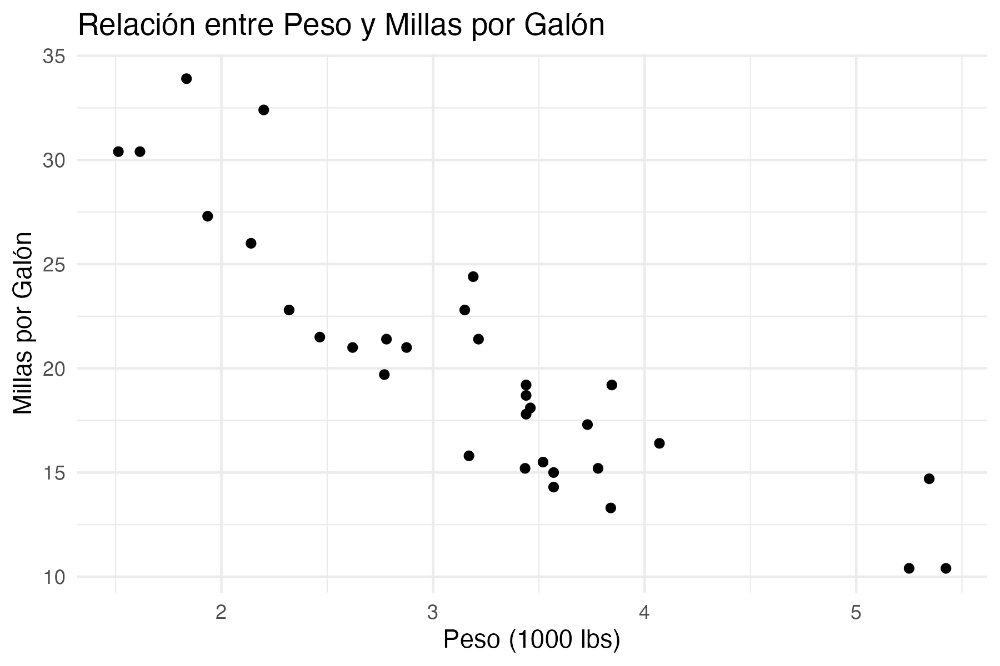

# Introducción al uso de `Quarto-Typst`

Este documento muestra un ejemplo mínimo de la plantilla. Para más información, consulta la [demo completa](https://kazuyanagimoto.com/quarto-academic-typst/template-full.pdf) y su [código fuente](https://kazuyanagimoto.com/quarto-academic-typst/template-full.qmd).  


## Sección como Encabezado Nivel 2 {#sec-level-2-ejemplo}

Puedes usar expresiones matemáticas en LaTeX:

$$
Y_{it} = \alpha_i + \lambda_t + \sum_{k \neq -1} \tau_h \mathbb{1}\{E_i + k = t\} +
\varepsilon_{it}.
$$

### Sección como Encabezado Nivel 3

No uso ni recomiendo usar niveles de encabezado 3 o inferiores, pero funciona. También se pueden hacer referencias cruzadas a secciones: como la anterior @sec-level-2-ejemplo (se ha escrito del siguiente modo: `@sec-level-2-ejemplo`).

## Citas

Puedes citar una referencia como esta [@katsushika1831] o @horst2020 (se ha escrito del siguiente modo: `como esta [@katsushika1831] o @horst2020`).

## Más sobre matemáticas

Se puede usar matemáticas resaltadas (centradas) al escribir una pareja de dos símbolos de dólar: `$$`.

$$
i^2 = j^2 = k^2 = ijk = −1
$$

$$
x = \frac{-b \pm \sqrt{b^2 - 4ac}}{2a}
$$

$$
\sum_{i = 1}^{n}{(\bar{x} - x_i)^2}
$$

Las anteriores ecuaciones, se han obtenido al escribir el código LaTeX siguiente:

```
$$
i^2 = j^2 = k^2 = ijk = −1
$$

$$
x = \frac{-b \pm \sqrt{b^2 - 4ac}}{2a}
$$

$$
\sum_{i = 1}^{n}{(\bar{x} - x_i)^2}
$$
```


La @eq-bayes muestra el Teorema de Bayes y la @eq-regresion muestra una fórmula usada en regresión lineal (se ha incluido referencias a estas fórmulas):

$$
Pr(\theta | y) = \frac{Pr(y | \theta) Pr(\theta)}{Pr(y)}
$$ {#eq-bayes}


$$
Y \sim \beta_0 + \beta_1 X + \epsilon
$$ {#eq-regresion}


Se han obtenido al escribir:

```
$$
Pr(\theta | y) = \frac{Pr(y | \theta) Pr(\theta)}{Pr(y)}
$$ {#eq-bayes}


$$
Y \sim \beta_0 + \beta_1 X + \epsilon
$$ {#eq-regresion}

```

Se pueden añadir definiciones y teoremas matemáticos, como se muestran a continuación con la @def-variable-aleatoria, el @thm-ley-grandes-numeros y también un ejemplo @exm-espacio-muestral.

::: {#def-variable-aleatoria}
##### Variable aleatoria

Una variable aleatoria es una función que asigna un valor numérico a cada resultado en el espacio muestral de un experimento aleatorio.
:::

::: {#thm-ley-grandes-numeros}
##### Ley de los grandes números

Sea $X_1, X_2, \ldots, X_n$ una secuencia de variables aleatorias independientes e idénticamente distribuidas con media $\mu$ y varianza finita $\sigma^2$. Entonces, para cualquier $\epsilon > 0$,
$$
\lim_{n \to \infty} P\left( \left| \frac{1}{n} \sum_{i=1}^{n} X_i - \mu \right| < \epsilon \right) = 1.
$$
:::

::: {#exm-espacio-muestral}
##### Espacio muestral

El espacio muestral de lanzar un dado es $\{1, 2, 3, 4, 5, 6\}$.
:::

::: {#exr-ejercicio-1} 
Calcula la media y la varianza de la variable aleatoria que representa el lanzamiento de un dado justo de seis caras.
:::

::: {.solution}
##### @exr-ejercicio-1

 Sea $X$ la variable aleatoria que representa el lanzamiento de un dado justo de seis caras. Los posibles valores de $X$ son $1, 2, 3, 4, 5, 6$, cada uno con probabilidad $\frac{1}{6}$.

La media de una variable aleatoria discreta se calcula como el valor esperado:
$$
E(X) = \sum_{i=1}^{n} x_i P(X = x_i)
$$
Para un dado justo de seis caras, cada cara tiene una probabilidad de $\frac{1}{6}$. Por lo tanto, la media es:
$$
E(X) = \sum_{i=1}^{6} i \cdot \frac{1}{6} = \frac{1 + 2 + 3 + 4 + 5 + 6}{6} = \frac{21}{6} = 3.5
$$
La varianza se calcula como:
$$
Var(X) = E(X^2) - [E(X)]^2
$$
Calculamos primero $E(X^2)$:
$$
E(X^2) = \sum_{i=1}^{6} i^2 \cdot \frac{1}{6} = \frac{1^2 + 2^2 + 3^2 + 4^2 + 5^2 + 6^2}{6} = \frac{91}{6}
$$
Luego, la varianza es:
$$
Var(X) = \frac{91}{6} - \left(\frac{21}{6}\right)^2 = \frac{91}{6} - \frac{441}{36} = \frac{35}{12} \approx 2.9167
$$
:::


En el @exr-ejercicio-1 se muestra un ejercicio con su solución.

::: {.callout-important}

##### **Nota Importante**: Prefijos para las etiquetas de bloques matemáticos

El código markdown utilizado se muestra a continuación, donde se ha usado `:::` para crear un bloque y se ha añadido un identificador con `{#etiqueta}` para poder referenciarlo después si se necesita (no es obligatorio), donde la etiqueta además de ser única, debe empezar por una letra y puede contener letras, números, guiones y guiones bajos. Para los resultados matemáticos **lo importante es que deben empezar** por 

- `def-` para definiciones, 
- `thm-` para teoremas, 
- `lem-` para lemas, 
- `cor-` para corolarios, 
- `prp-` para proposiciones, 
- `exm-` para ejemplos,
- `exr-` para ejercicios,


Para demostraciones de teoremas, lemas, corolarios y proposiciones, se usa el entorno `.proof`, que no necesita etiqueta. Y para las soluciones de ejercicios, se usa el entorno `.solution`, que debe tener la etiqueta del ejercicio correspondiente en el título.
:::


::: {.proof}
La demostración se deja como ejercicio para el lector.
:::


```markdown
::: {#def-variable-aleatoria}
##### Variable aleatoria

Una variable aleatoria es una función que asigna un valor numérico a cada resultado en el espacio muestral de un experimento aleatorio.
:::

::: {#thm-ley-grandes-numeros}
##### Ley de los grandes números

Sea $X_1, X_2, \ldots, X_n$ una secuencia de variables aleatorias independientes e idénticamente distribuidas con media $\mu$ y varianza finita $\sigma^2$. Entonces, para cualquier $\epsilon > 0$,
$$
\lim_{n \to \infty} P\left( \left| \frac{1}{n} \sum_{i=1}^{n} X_i - \mu \right| < \epsilon \right) = 1.
$$
:::

::: {#exm-espacio-muestral}
##### Espacio muestral

El espacio muestral de lanzar un dado es $\{1, 2, 3, 4, 5, 6\}$.
:::

::: {#exr-ejercicio-1} 
Calcula la media y la varianza de la variable aleatoria que representa el lanzamiento de un dado justo de seis caras.
:::


::: {.proof}
La demostración se deja como ejercicio para el lector.
:::


```


# Figuras y Tablas

## Figuras

Como muestra @fig-hist-mpg, el pie de figura se muestra debajo de la figura.  
En el pie de figura (`fig-cap`), uso texto en **negrita** para el título y texto normal para la descripción.

```{r}
#| label: fig-hist-mpg
#| fig-cap: "**Histograma de Millas por Galón**. El eje x muestra las millas por galón, y el eje y muestra la frecuencia."
#| echo: false

hist(mtcars$mpg)
```

También se puede presentar una figura creada con R sin mostrar el código R, usando `echo: false`, como la @fig-boxplot-mpg.
```{r}
#| label: fig-boxplot-mpg
#| fig-cap: "**Diagrama de Caja de Millas por Galón**. El eje y muestra las millas por galón."
#| echo: false

boxplot(mtcars$mpg, horizontal = TRUE, col = "lightblue")
```

## Gráficos externos

También se pueden incluir ficheros gráficos externos (png o jpg), descargados, capturados o creados por nosotros mismos. Hay varias formas de hacerlo, pero la más sencilla es usar el siguiente código (con ayuda de R y el paquete "knitr") en la que además incluye una leyenda o explicación de la figura y una etiqueta para poder referenciarla antes o después: @fig-external-image.

```{r}
#| label: fig-external-image
#| fig-cap: "**Imagen Externa**. Esta imagen se ha incluido desde un fichero externo."
#| echo: false
#| out.width: "50%"
#| fig-align: "center"
#| fig-alt: "Descripción alternativa de la imagen externa"
#| fig-pos: "H"


```

El código necesario para incluir la imagen externa anterior es el siguiente:

```{{r}}
#| label: fig-external-image
#| fig-cap: "**Imagen Externa**. Esta imagen se ha incluido desde un fichero externo."
#| echo: false
#| out.width: "50%"
#| fig-align: "center"
#| fig-alt: "Descripción alternativa de la imagen externa"
#| fig-pos: "H"


```


También es posible utilizar código markdown para incluir la imagen externa, como se muestra a continuación en la @fig-external-image-2 (con las mismas opciones que el código anterior):

```markdown
{#fig-external-image-2 width="50%" fig-alt="Descripción alternativa de la imagen externa" fig-cap="Descripción alternativa de la imagen externa" fig-pos="H"}
```

{#fig-external-image-2 width="50%" fig-alt="Descripción alternativa de la imagen externa" fig-pos="H"}

Y también es posible incluir una imagen externa usando el primer método (no funciona con el segundo método), pero sin mostrar ninguna leyenda ni añadiendo ninguna etiqueta para referenciarla, como se muestra a continuación:

```{r}
#| echo: false
#| out.width: "20%"
#| fig-align: "right"


```

El código necesario para incluir la imagen externa anterior es el siguiente:

```{{r}}
#| echo: false
#| out.width: "20%"
#| fig-align: "right"

```

#### Gráficos externos generados con R

También es posible guardar un gráfico generado con R en un fichero externo (png o jpg) y luego incluirlo en el documento, como se muestra a continuación en la @fig-external-image-3. Se debe aclarar que el gráfico se ha generado con R, ggplot2 y se ha guardado en un fichero externo. El código se ha incluido en este documento, pero no se evalúa ni se muestra (`eval: false` y `echo: false`), ya que el gráfico ya se ha generado y guardado en un fichero externo. Pero se podría haber guardado el código en otro fichero R distinto y ejecutarlo por separado para generar el gráfico y guardarlo en el fichero externo.

```{r}
#| include: false
#| eval: false
library(ggplot2)
# Crear el gráfico
p <- ggplot(mtcars, aes(x = wt, y = mpg)) +
  geom_point() +
  labs(title = "Relación entre Peso y Millas por Galón",
       x = "Peso (1000 lbs)",
       y = "Millas por Galón") +
  theme_minimal()
# Guardar el gráfico en un archivo externo
ggsave("scatterplot_mtcars.png", plot = p, width = 6, height = 4)
```

```{r}
#| label: fig-external-image-3
#| fig-cap: "**Imagen Externa 3**. Esta imagen se ha generado con R, ggplot2 y se ha guardado en un fichero externo."
#| echo: false
#| out.width: "50%"
#| fig-align: "center"
#| fig-alt: "Descripción alternativa de la imagen externa"

```

El código necesario para incluir la imagen externa anterior es el siguiente:

```{{r}}
#| include: false
#| eval: false
library(ggplot2)
# Crear el gráfico
p <- ggplot(mtcars, aes(x = wt, y = mpg)) +
  geom_point() +
  labs(title = "Relación entre Peso y Millas por Galón",
       x = "Peso (1000 lbs)",
       y = "Millas por Galón") +
  theme_minimal()
# Guardar el gráfico en un archivo externo
ggsave("scatterplot_mtcars.png", plot = p, width = 6, height = 4)
```

```{{r}}
#| label: fig-external-image-3
#| fig-cap: "**Imagen Externa 3**. Esta imagen se ha generado con R, ggplot2 y se ha guardado en un fichero externo."
#| echo: false
#| out.width: "50%"
#| fig-align: "center"
#| fig-alt: "Descripción alternativa de la imagen externa"

```

::: {.callout-note}
- Esta estrategia de guardar un gráfico generado con R o Python en un fichero de script externo y luego incluirlo en el documento es útil cuando se desea reutilizar el gráfico en múltiples documentos o cuando se quiere mantener el código de generación del gráfico separado del documento principal.

- También **acelera el tiempo de compilación del documento Quarto**, ya que el gráfico no necesita ser regenerado cada vez que se compila el documento, sino que simplemente se incluye la imagen ya generada.

- También sería posible incluir tablas (u otro tipo de objetos, como: `summary()`, ...) generadas con R en ficheros externos y luego incluirlas en el documento Quarto. Con ayuda de las funciones `save()` y `load()` de R, se pueden guardar y cargar objetos R, incluyendo data frames que representan tablas. Pero en este caso no es necesario, ya que las tablas generadas con R se pueden incluir directamente en el documento Quarto, como se muestra en la siguiente sección.
:::


## Tablas

Puedes usar [tinytable](https://vincentarelbundock.github.io/tinytable/) para tablas generales y [modelsummary](https://vincentarelbundock.github.io/modelsummary/) para tablas de regresión.^[Dado que el backend predeterminado de `modelsummary` es `tinytable`, puedes usar las opciones de personalización de `tinytable` para `modelsummary`.]  

Como muestra @tbl-mtcars-head, el pie de tabla se muestra encima de la tabla. Las notas de la tabla pueden añadirse con el argumento `notes` de la función `tinytable::tt()`.

```{r}
#| label: tbl-mtcars-head
#| tbl-cap: Encabezado del Conjunto de Datos mtcars
#| echo: false
library(tinytable)
nt <- "_Notas_: Esta tabla muestra las primeras seis filas del conjunto de datos mtcars."
mtcars[1:5, 1:5] |>
  tinytable::tt(width = 0.8, notes = nt)         
```

### Tablas con `knitr::kable()`

También es posible usar `knitr::kable()` para crear tablas simples, como la @tbl-summary-mtcars-AA.

```{r}
#| label: tbl-summary-mtcars-AA
#| tbl-cap: "**Primeras filas de mtcars**. Presentados con la función kable del paquete knitr."
#| echo: false
#| tbl-align: "center"
library(knitr)
mtcars[,(1:4)] |>
    head(6) |>
    kable()
```

Incluyendo el siguiente código:

```{{r}}
#| label: tbl-summary-mtcars-AA
#| tbl-cap: "**Primeras filas de mtcars**. Presentados con la función kable del paquete knitr."
#| echo: false
#| tbl-align: "center"
library(knitr)
mtcars[,(1:4)] |>
    head(6) |>
    kable()
```

También es posible no añadir una leyenda ni una etiqueta para referenciarla, como se muestra a continuación (al igual que en las figuras), aunque esto no es recomendable, ya que las tablas deben tener siempre una leyenda y una etiqueta para referenciarlas.

```{r}
#| echo: false
#| results: "asis"
#| tbl-align: "left"
library(knitr)
mtcars[,c(1:4,7,6)] |>
    tail(6) |>
    kable()
```


El código necesario para crear la tabla anterior es el siguiente:

```{{r}}
#| echo: false
#| results: "asis"
#| tbl-align: "left"
library(knitr)
mtcars[,c(1:4,7,6)] |>
    tail(6) |>
    kable()
```


### Tablas con código markdown

También es posible usar código markdown para crear tablas simples (se pueden justificar de forma independiente las columnas), como la @tbl-summary-mtcars-AAA.

::: {#tbl-summary-mtcars-AAA}

| mpg | cyl | disp | hp |
|-----|:-----|------:|:----:|
| 21  | 6   | 160  | 110|
| 22.8| 4   | 108  | **93** |
| 21.4| 6   | 258  | 110|
| 18.7| 8   | 360  | 175|
| 18.1| 6   | 225  | 105|

: **Primeras filas de mtcars**. Presentados con código markdown. {tbl-colwidths: [25,25,25,25]}

:::

El código necesario para crear la tabla anterior es el siguiente:

``````markdown
::: {#tbl-summary-mtcars-AAA}

| mpg | cyl | disp | hp |
|-----|:-----|------:|:----:|
| 21  | 6   | 160  | 110|
| 22.8| 4   | 108  | **93** |
| 21.4| 6   | 258  | 110|
| 18.7| 8   | 360  | 175|
| 18.1| 6   | 225  | 105|

: "**Primeras filas de mtcars**. Presentados con código markdown." {tbl-align="left"}

:::
``````

### Subtablas


::: {#tbl-panel layout-ncol=2}
| Col1 | Col2 | Col3 |
|------|------|------|
| A    | B    | C    |
| E    | F    | G    |
| A    | G    | G    |

: Primera tabla {#tbl-primera}

| Col1 | Col2 | Col3 |
|------|------|------|
| A    | B    | C    |
| E    | F    | G    |
| A    | G    | G    |

: Segunda Tabla {#tbl-segunda}

Leyenda común a ambas tablas.
:::

Vea @tbl-panel para detalles, especialmente @tbl-segunda.

El código necesario para crear la tabla anterior es el siguiente:

``````markdown
::: {#tbl-panel layout-ncol=2}
| Col1 | Col2 | Col3 |
|------|------|------|
| A    | B    | C    |
| E    | F    | G    |
| A    | G    | G    |

: Primera tabla {#tbl-primera}

| Col1 | Col2 | Col3 |
|------|------|------|
| A    | B    | C    |
| E    | F    | G    |
| A    | G    | G    |

: Segunda Tabla {#tbl-segunda}

Leyenda común a ambas tablas.
:::
``````

También se podría presentar una tabla frente a una imagen, como se muestra a continuación:

::: {#tbl-fig-panel layout-ncol=2}
| Col1 | Col2 | Col3 |
|------|------|------|
| A    | B    | C    |
| E    | F    | G    |
| A    | G    | G    |
: Primera tabla {#tbl-primera-fig}

```{r}
#| echo: false
#| out.width: "2cm"
#| label: fig-segunda-fig
#| cap-location: top
#| fig-cap: "**Logo**. Imagen de fichero externo."


```
Leyenda común a ambas tabla-figura.
:::


El código necesario para crear la tabla-figura anterior es el siguiente:


`````markdown
::: {#tbl-fig-panel layout-ncol=2}
| Col1 | Col2 | Col3 |
|------|------|------|
| A    | B    | C    |
| E    | F    | G    |
| A    | G    | G    |
: Primera tabla {#tbl-primera-fig}

```{{r}}
#| echo: false
#| out.width: "2cm"
#| label: fig-segunda-fig
#| cap-location: top
#| fig-cap: "**Logo**. Imagen de fichero externo."


```
Leyenda común a ambas tabla-figura.
:::
`````

### Tablas markdown con método grid 

La @tbl-grid muestra una tabla creada con el método grid.

+-----------+-----------+--------------------+
| Fruta     | Precio    | Ventajas           |
+===========+===========+:===================+
| Bananas   | $1.34     | - fácil de pelar   |
|           |           | - color brillante  |
+-----------+-----------+--------------------+
| Naranjas  | $2.10     | - cura el escorbuto|
|           |           | - sabrosa          |
+-----------+-----------+--------------------+

: Ejemplo de tabla grid {#tbl-grid tbl-align="center"}

El código necesario para crear la tabla anterior es el siguiente:

`````markdown
+-----------+-----------+--------------------+
| Fruta     | Precio    | Ventajas           |
+===========+===========+:===================+
| Bananas   | $1.34     | - fácil de pelar   |
|           |           | - color brillante  |
+-----------+-----------+--------------------+
| Naranjas  | $2.10     | - cura el escorbuto|
|           |           | - sabrosa          |
+-----------+-----------+--------------------+

: Ejemplo de tabla grid {#tbl-grid tbl-align="center"}
`````

### Tablas y Figuras en salidas Typst no logra el posicionamiento LaTeX

:::{.callout-note}
Las tablas y figuras en Quarto con salida Typst no pueden usar directamente los códigos de posicionamiento de LaTeX (t, b, H, etc.). Estos son específicos de LaTeX y no tienen equivalente directo en Typst.
:::


### Tablas con justificación personalizada

Este ejemplo muestra cómo crear una tabla con `tinytable` que aplique justificación personalizada según el tipo de dato de cada columna, como se muestra en la @tbl-ejemplo-justificacion.

```{r}
#| label: tbl-ejemplo-justificacion
#| tbl-cap: "Tabla con justificación personalizada por tipo de dato"
#| echo: false
#| warning: false
#| message: false

library(tinytable)

datos_ejemplo <- data.frame(
  Pais = c("España", "Francia", "Alemania", "Italia", "Portugal"),
  Ciudad = c("Madrid", "París", "Berlín", "Roma", "Lisboa"),
  Poblacion = c(47420000L, 67390000L, 83780000L, 60360000L, 10350000L),
  Superficiekm2 = c(505990.3, 551695.75, 357588.1, 301340.52, 92212.8),
  Densidad = c(93.72, 122.11, 234.31, 200.27, 112.24),
  Moneda = c("Euro", "Euro", "Euro", "Euro", "Euro"),
  stringsAsFactors = FALSE
)

crear_tabla_justificada <- function(df, vdecimales = NULL, striped = FALSE) {
  tipos <- sapply(df, class)
  tt <- tt(df)
  if (striped) tt <- theme_striped(tt)
  if (!is.null(vdecimales)) {
    for (col in names(vdecimales)) {
      j <- as.integer(col)
      dec <- vdecimales[[col]]
      tt <- format_tt(tt, j = j, sprintf = paste0("%.", dec, "f"))
    }
  }
  for (i in seq_along(tipos)) {
    if (tipos[i] %in% c("character", "factor")) {
      tt <- style_tt(tt, j = i, align = "l")
    } else if (tipos[i] %in% c("integer", "numeric")) {
      tt <- style_tt(tt, j = i, align = "r")
    }
  }
  tt <- style_tt(tt, i = 0, j = seq_along(tipos), align = "c", bold = TRUE)
  tt
}

crear_tabla_justificada(datos_ejemplo, vdecimales = c("4" = 2, "5" = 1), striped = TRUE)
```

*Nota*: Los valores de población y superficie están expresados en unidades del año 2023. La densidad se calcula como población/km².

El código necesario para crear la tabla anterior es el siguiente:

```{r}
#| eval: false
#| echo: true

library(tinytable)

datos_ejemplo <- data.frame(
  Pais = c("España", "Francia", "Alemania", "Italia", "Portugal"),
  Ciudad = c("Madrid", "París", "Berlín", "Roma", "Lisboa"),
  Poblacion = c(47420000L, 67390000L, 83780000L, 60360000L, 10350000L),
  Superficiekm2 = c(505990.3, 551695.75, 357588.1, 301340.52, 92212.8),
  Densidad = c(93.72, 122.11, 234.31, 200.27, 112.24),
  Moneda = c("Euro", "Euro", "Euro", "Euro", "Euro"),
  stringsAsFactors = FALSE
)

crear_tabla_justificada <- function(df, vdecimales = NULL, striped = FALSE) {
  tipos <- sapply(df, class)
  tt <- tt(df)
  if (striped) tt <- theme_striped(tt)
  if (!is.null(vdecimales)) {
    for (col in names(vdecimales)) {
      j <- as.integer(col)
      dec <- vdecimales[[col]]
      tt <- format_tt(tt, j = j, sprintf = paste0("%.", dec, "f"))
    }
  }
  for (i in seq_along(tipos)) {
    if (tipos[i] %in% c("character", "factor")) {
      tt <- style_tt(tt, j = i, align = "l")
    } else if (tipos[i] %in% c("integer", "numeric")) {
      tt <- style_tt(tt, j = i, align = "r")
    }
  }
  tt <- style_tt(tt, i = 0, j = seq_along(tipos), align = "c", bold = TRUE)
  tt
}

crear_tabla_justificada(datos_ejemplo, vdecimales = c("4" = 2, "5" = 1), striped = TRUE)
```

### Tablas con scale-down (zoom para tablas anchas)

Cuando una tabla tiene muchas columnas y no cabe en el ancho de página, Typst la rompe insertando saltos de línea que afean el resultado. La función `scale-down` detecta automáticamente si la tabla es más ancha que la página y la escala proporcionalmente para que entre completa. El resultado se muestra en la @tbl-scale-down.

::: {.callout-note}
La función `scale-down` se ha definido en la cabecera YAML del documento mediante `include-in-header`, lo que la inyecta al inicio del código Typst (antes de la función `article()`). El siguiente fragmento muestra cómo se añade:

```yaml
format:
  memoriatfetypst-typst:
    include-in-header:
      text: |
        #let scale-down(body) = layout(size => {
          let body-size = measure(body)
          if body-size.width > size.width {
            let f = size.width / body-size.width * 100%
            scale(x: f, y: f, reflow: true, body)
          } else {
            body
          }
        })
```

Para usar `scale-down` con `tinytable`, se envuelve la tabla generada con `#scale-down[...]` mediante `style_tt(finalize = ...)`:

```r
style_tt(finalize = function(x) {
  x@table_string <- paste0(
    "#scale-down[\n#set table(inset: (x: 5pt, y: 3pt))\n",
    x@table_string, "\n]"
  )
  x
})
```

Este método también funciona con cualquier otro contenido Typst que necesite escalado.
:::

```{r}
#| label: tbl-scale-down
#| tbl-cap: "Costes mensuales por escenario LTV — con scale-down"
#| echo: false
#| warning: false
#| message: false

library(tinytable)

tbl <- data.frame(
  Scenario        = c("High LTV (15% down)", "Medium LTV (35% down)", "Low LTV (55% down)"),
  Amort           = c("2%", "1%", "0%"),
  Downpayment     = c(172500, 402500, 632500),
  Amortization    = c(16292, 6229, 0),
  Interest_272    = c(16754, 12635, 8517),
  Fee             = c(7505, 7505, 7505),
  Total_272       = c(40550, 26369, 16022),
  Interest_700    = c(44296, 33697, 23098),
  Total_700       = c(68093, 47431, 30603)
) |>
  setNames(c("Scenario", "Amort.", "Downpayment",
             "Amortization", "Interest 2.72%", "Fee", "Total 2.72%",
             "Interest 7%", "Total 7%"))

tt(tbl,
   caption = "Costes mensuales por escenario LTV — con scale-down",
   notes = "Los tipos de interés son anuales. Deducción fiscal: 30% sobre los primeros 100k SEK/año, 21% sobre el exceso."
) |>
  group_tt(j = setNames(list(8:9), "Peor caso 7%")) |>
  style_tt(j = c(7, 9), bold = TRUE) |>
  style_tt(finalize = function(x) {
    x@table_string <- paste0("#scale-down[\n#set table(inset: (x: 5pt, y: 3pt))\n", x@table_string, "\n]")
    x
  })
```

El código necesario para crear la tabla anterior es el siguiente:

```{r}
#| eval: false
#| echo: true

library(tinytable)

tbl <- data.frame(
  Scenario        = c("High LTV (15% down)", "Medium LTV (35% down)", "Low LTV (55% down)"),
  Amort           = c("2%", "1%", "0%"),
  Downpayment     = c(172500, 402500, 632500),
  Amortization    = c(16292, 6229, 0),
  Interest_272    = c(16754, 12635, 8517),
  Fee             = c(7505, 7505, 7505),
  Total_272       = c(40550, 26369, 16022),
  Interest_700    = c(44296, 33697, 23098),
  Total_700       = c(68093, 47431, 30603)
) |>
  setNames(c("Scenario", "Amort.", "Downpayment",
             "Amortization", "Interest 2.72%", "Fee", "Total 2.72%",
             "Interest 7%", "Total 7%"))

tt(tbl,
   caption = "Costes mensuales por escenario LTV — con scale-down",
   notes = "Los tipos de interés son anuales. Deducción fiscal: 30% sobre los primeros 100k SEK/año, 21% sobre el exceso."
) |>
  group_tt(j = setNames(list(8:9), "Peor caso 7%")) |>
  style_tt(j = c(7, 9), bold = TRUE) |>
  style_tt(finalize = function(x) {
    x@table_string <- paste0("#scale-down[\n#set table(inset: (x: 5pt, y: 3pt))\n", x@table_string, "\n]")
    x
  })
```

### Tablas con formato condicional y cabeceras multilínea

Este ejemplo muestra cómo crear tablas con `tinytable` aplicando formato condicional, cabeceras multilínea y estilo personalizado por filas. La @tbl-tabla-politicas3 ilustra el resultado.

```{r}
#| echo: false
#| label: tbl-tabla-politicas3
#| tbl-cap: "Indicadores de política familiar en países europeos seleccionados (2022). Fuente: OCDE (2023)."

library(tinytable)

tabla_politicas <- data.frame(
  País = c("Suecia", "Francia", "Alemania", "España", "Italia"),
  `Permiso de paternidad remunerado (semanas)` = c(10, 2.5, 2, 16, 1),
  `Gasto público en familia (% PIB)` = c(3.4, 2.9, 2.3, 1.3, 1.6),
  check.names = FALSE
)

colnames(tabla_politicas) <- c(
  "País",
  "Permiso de paternidad<br>remunerado (semanas)",
  "Gasto público<br>en familia<br>(% PIB)"
)

tt(tabla_politicas,
   width = c(0.15, 0.30, 0.20)
   ) |>
   format_tt(linebreak = "<br>") |>
   format_tt(j = 2:3, digits = 2, num_mark_big = " ", num_mark_dec = ".", num_zero = TRUE, num_fmt = "decimal") |>
   style_tt(i = 0, j = 1:3, align = "lcc") |>
   style_tt(i = 1:5, j = 1:3, align = "lcc") |>
   style_tt(i = 0, background = "#E5E5E5", bold = TRUE) |>
   style_tt(i = c(2, 4), background = "#F7F7F7") |>
   style_tt(
     i = which(tabla_politicas$País == "España"),
     background = "#FFEEEE",
     bold = TRUE,
     color = "#C0392B"
   )
```

El código necesario para crear la tabla anterior es el siguiente:

```{r}
#| eval: false
#| echo: true

library(tinytable)

tabla_politicas <- data.frame(
  País = c("Suecia", "Francia", "Alemania", "España", "Italia"),
  `Permiso de paternidad remunerado (semanas)` = c(10, 2.5, 2, 16, 1),
  `Gasto público en familia (% PIB)` = c(3.4, 2.9, 2.3, 1.3, 1.6),
  check.names = FALSE
)

colnames(tabla_politicas) <- c(
  "País",
  "Permiso de paternidad<br>remunerado (semanas)",
  "Gasto público<br>en familia<br>(% PIB)"
)

tt(tabla_politicas, width = c(0.15, 0.30, 0.20)) |>
  format_tt(linebreak = "<br>") |>
  format_tt(j = 2:3, digits = 2, num_mark_big = " ", num_mark_dec = ".", num_zero = TRUE, num_fmt = "decimal") |>
  style_tt(i = 0, j = 1:3, align = "lcc") |>
  style_tt(i = 1:5, j = 1:3, align = "lcc") |>
  style_tt(i = 0, background = "#E5E5E5", bold = TRUE) |>
  style_tt(i = c(2, 4), background = "#F7F7F7") |>
  style_tt(
    i = which(tabla_politicas$País == "España"),
    background = "#FFEEEE",
    bold = TRUE,
    color = "#C0392B"
  )
```

### Tablas de Regresión

Puedes usar `modelsummary` para crear tablas de regresión.

```{r}
#| label: tbl-regression
#| tbl-cap: Resultados de Regresión del Conjunto de Datos mtcars
#| warning: false
#| echo: false

library(modelsummary)
r1 = modelsummary::msummary(
  list(
    lm(mpg ~ wt + hp, data = mtcars),
    lm(mpg ~ wt + hp + qsec, data = mtcars)
  ),
  #output = "markdown",
  #output = "tinytable",
  fmt = 2,
  coef_rename = c("wt" = "Peso", "hp" = "Caballos de Fuerza", "qsec" = "Tiempo en 1/4 de Milla"),
  gof_map = c("nobs", "r.squared", "adj.r.squared"),
  statistic = "{std.error} ({statistic})",
  notes = "_Notas_: Esta tabla muestra los resultados de la regresión del conjunto de datos mtcars."
)
r1
```


<!-- {} -->

```{r}
#| child: "capitulo03.qmd"
#| echo: false
```




<!-- ## Conclusiones  {.unnumbered} -->

## Conclusiones


Este documento ha presentado una plantilla mínima para trabajos académicos utilizando Quarto y Typst. Se han mostrado ejemplos de cómo incluir matemáticas, figuras, tablas y referencias bibliográficas. La plantilla está diseñada para ser fácil de usar y personalizar según las necesidades específicas del usuario.




<!-- {} -->

```{r}
#| child: "apendice01.qmd"
#| echo: false
```

